# 🎵 SoundCloud Clone - Full-Stack Learning Project

A comprehensive full-stack music streaming application featuring a **production NestJS backend**, a Next.js client application with advanced rendering strategies, and a Vite-based admin dashboard. This project demonstrates modern web development practices including OAuth authentication, SEO optimization, and multiple rendering strategies (CSR, SSG, SSR).


---

## 🎯 Key Features & Highlights

### 🎵 Track Detail & Audio Player

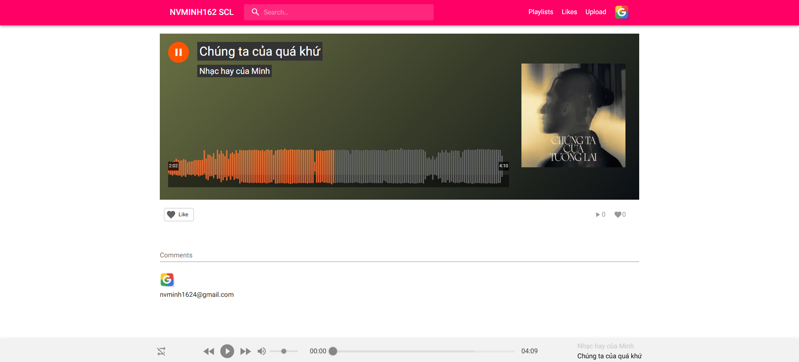

Interactive track detail page with advanced audio player features:

#### Audio Player Features
- **Waveform Visualization**: Real-time waveform display with playback progress
- **Playback Controls**: Play, pause, seek, volume control
- **Track Information**: Title, artist, album art display
- **Progress Tracking**: Current time and total duration
- **Like System**: One-click track liking with heart icon
- **Play Count**: Track play statistics

#### Player Interface
- **Main Player**: Large waveform visualization with orange progress indicator
- **Album Art**: High-quality cover image display
- **Controls**: Shuffle, previous, play/pause, next, volume slider
- **Persistent Player Bar**: Bottom player bar for continuous playback
- **Comments Section**: User comments and interactions

#### Technical Implementation
- **Wavesurfer.js**: Advanced waveform rendering and audio visualization
- **React H5 Audio Player**: Customizable audio player component
- **Real-time Updates**: Live progress tracking and state management
- **Responsive Design**: Optimized for all screen sizes

### 🔍 SEO Optimization

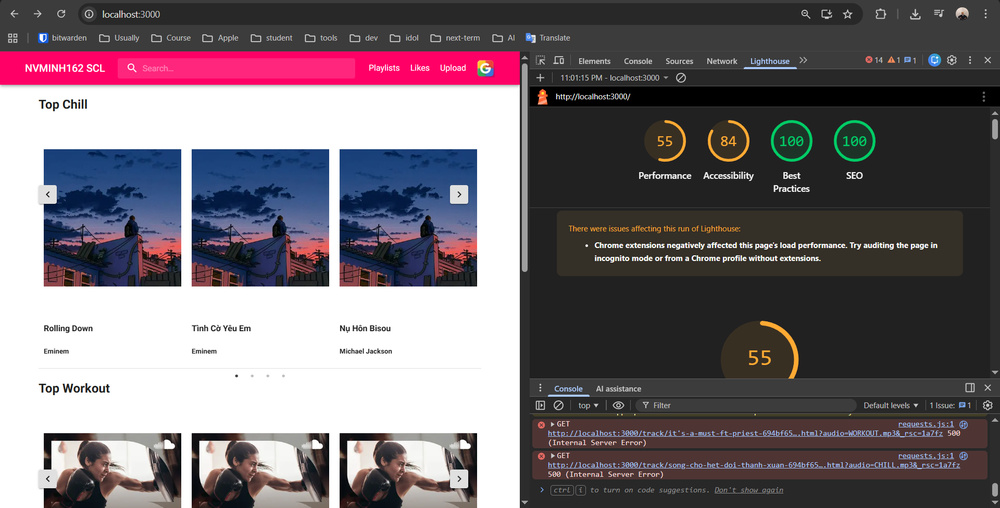

Comprehensive SEO implementation following industry best practices:

#### Technical SEO
- **Sitemap Generation**: Dynamic XML sitemap (`/sitemap.xml`)
- **Robots.txt**: Configurable crawler directives
- **Meta Tags**: Dynamic Open Graph, Twitter Cards
- **Structured Data**: JSON-LD for rich snippets
- **Canonical URLs**: Proper URL canonicalization

#### Performance SEO
- **Image Optimization**: Next.js Image component with responsive images
- **Code Splitting**: Automatic route-based code splitting
- **Lazy Loading**: Component and image lazy loading
- **Bundle Optimization**: Tree shaking, minification
- **First Load JS**: Optimized to 305 kB shared bundle

#### Content SEO
- **Dynamic Meta Tags**: Per-page title, description, keywords
- **Semantic HTML**: Proper heading hierarchy, ARIA labels
- **URL Structure**: SEO-friendly slugs and paths
- **Content Optimization**: Proper heading tags, alt text

**SEO Checklist Implementation:**
- ✅ Sitemap.xml generation
- ✅ Robots.txt configuration
- ✅ Meta tags optimization
- ✅ Open Graph tags
- ✅ Twitter Card tags
- ✅ Structured data (JSON-LD)
- ✅ Image optimization
- ✅ Mobile responsiveness
- ✅ Page speed optimization
- ✅ Accessibility (WCAG compliance)

### 🔐 Multi-Provider OAuth Authentication

The project implements comprehensive authentication with multiple providers, demonstrating industry-standard OAuth flows:

#### GitHub OAuth Integration
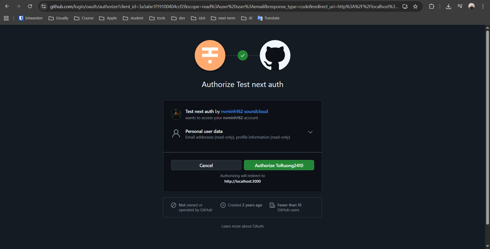

- **Provider**: GitHub OAuth 2.0
- **Scopes**: `read:user`, `user:email`
- **Implementation**: NextAuth.js with custom backend integration
- **Features**:
  - Secure token exchange
  - User profile synchronization
  - Automatic account creation
  - Session management with JWT

#### Google OAuth Integration
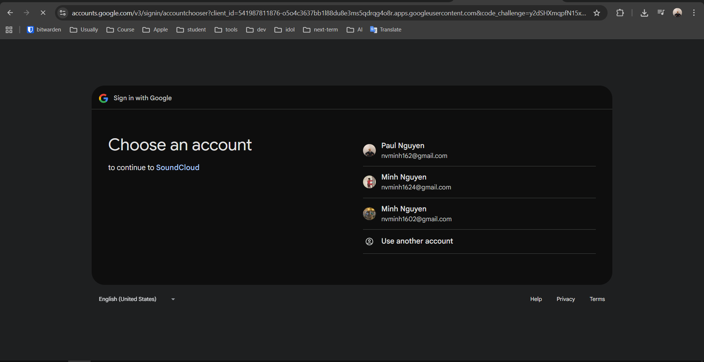

- **Provider**: Google OAuth 2.0
- **Scopes**: Email, Profile
- **Implementation**: NextAuth.js Google Provider
- **Features**:
  - Account chooser integration
  - Multi-account support
  - Seamless sign-in experience
  - Profile data synchronization

**Authentication Flow:**
1. User initiates OAuth flow via NextAuth.js
2. Redirect to provider (GitHub/Google) authorization page
3. User grants permissions
4. Provider redirects back with authorization code
5. Backend exchanges code for access tokens
6. User profile created/updated in database
7. JWT tokens issued for session management

### 🚀 Advanced Rendering Strategies

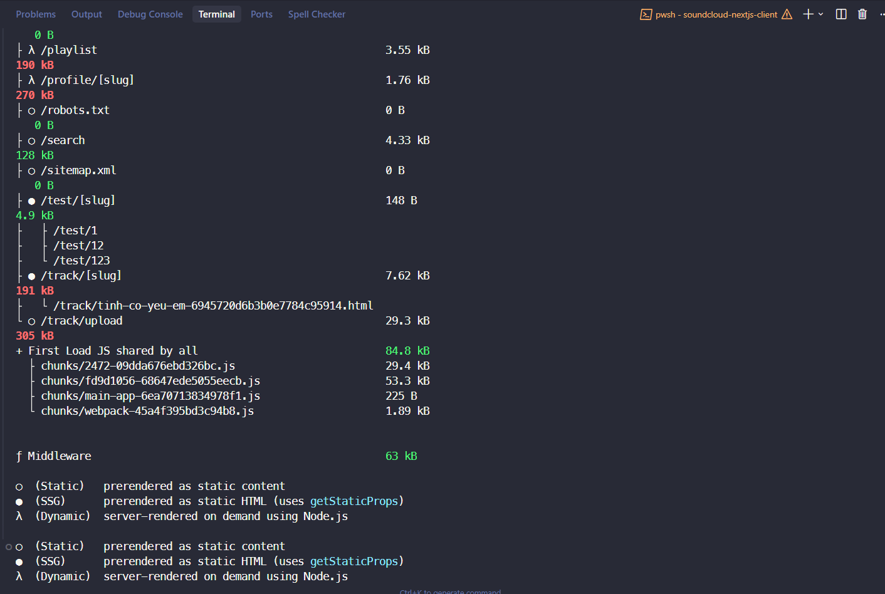

The Next.js client application demonstrates mastery of all three primary rendering strategies:

#### Client-Side Rendering (CSR)
- **Use Cases**: Interactive components, user-specific content, real-time updates
- **Implementation**: React hooks, client-side data fetching
- **Benefits**: Dynamic content, reduced server load, better interactivity

#### Static Site Generation (SSG)
- **Use Cases**: Track pages, profile pages, public content
- **Implementation**: `getStaticProps`, `getStaticPaths`
- **Benefits**: 
  - Lightning-fast page loads
  - Excellent SEO performance
  - CDN-friendly content delivery
  - Reduced server costs

#### Server-Side Rendering (SSR)
- **Use Cases**: Search results, personalized content, dynamic routes
- **Implementation**: `getServerSideProps`, Server Components (Next.js 14)
- **Benefits**:
  - Always fresh content
  - SEO-friendly dynamic pages
  - Personalized user experience
  - Server-side data fetching

**Route Analysis:**
- `/playlist` - 190 kB (Dynamic rendering)
- `/profile/[slug]` - 270 kB (SSG with dynamic paths)
- `/track/[slug]` - 191 kB (SSG with ISR)
- `/search` - 128 kB (SSR for real-time results)
- `/test/[slug]` - 4.9 kB (SSG examples)

---

## 📁 Project Structure

```
soundcloud-app/
├── soundcloud-be/                    # NestJS Backend (Production)
│   ├── src/
│   │   ├── auth/                     # Authentication module
│   │   │   ├── auth.controller.ts
│   │   │   ├── auth.service.ts
│   │   │   ├── jwt-auth.guard.ts
│   │   │   ├── local-auth.guard.ts
│   │   │   └── passport/             # Passport strategies
│   │   ├── users/                    # User management
│   │   ├── tracks/                   # Track/audio management
│   │   ├── playlists/                # Playlist functionality
│   │   ├── comments/                 # Comment system
│   │   ├── likes/                    # Like/favorite system
│   │   ├── files/                    # File upload handling
│   │   ├── mail/                     # Email service
│   │   ├── databases/                # Database utilities
│   │   ├── health/                   # Health checks
│   │   └── core/                     # Core utilities
│   │       ├── delay.middleware.ts
│   │       ├── http-exception.filter.ts
│   │       └── transform.interceptor.ts
│   ├── public/                       # Static assets
│   │   ├── images/                   # Uploaded images
│   │   └── tracks/                   # Audio files
│   ├── postman/                      # API documentation
│   └── package.json
│
├── soundcloud-fe/
│   ├── soundcloud-nextjs-client/     # Next.js 14 Client App
│   │   ├── src/
│   │   │   ├── app/                  # App Router (Next.js 14)
│   │   │   │   ├── (guest)/          # Guest routes
│   │   │   │   │   └── auth/
│   │   │   │   ├── (user)/           # Protected user routes
│   │   │   │   │   ├── page.tsx      # Home page
│   │   │   │   │   ├── playlist/     # Playlist management
│   │   │   │   │   ├── like/         # Favorites page
│   │   │   │   │   ├── profile/      # User profiles
│   │   │   │   │   └── track/upload/ # Track upload
│   │   │   │   ├── api/              # API routes
│   │   │   │   │   ├── auth/         # NextAuth.js
│   │   │   │   │   └── revalidate/   # ISR revalidation
│   │   │   │   ├── search/           # Search functionality
│   │   │   │   ├── track/[slug]/     # Dynamic track pages
│   │   │   │   ├── layout.tsx        # Root layout
│   │   │   │   ├── sitemap.ts        # Sitemap generation
│   │   │   │   └── robots.ts         # Robots.txt
│   │   │   ├── components/           # React components
│   │   │   │   ├── auth/             # Auth components
│   │   │   │   ├── header/           # Navigation header
│   │   │   │   ├── footer/           # Footer component
│   │   │   │   ├── track/            # Track components
│   │   │   │   └── theme-registry/   # MUI theme
│   │   │   ├── lib/                  # Utilities & wrappers
│   │   │   ├── utils/                # Helper functions
│   │   │   └── types/                # TypeScript types
│   │   ├── public/                   # Static files
│   │   ├── middleware.ts             # Auth middleware
│   │   └── package.json
│   │
│   └── soundcloud-vite-admin/        # Vite Admin Dashboard
│       ├── src/
│       │   ├── screens/              # Page components
│       │   │   ├── users.page.tsx
│       │   │   ├── tracks.page.tsx
│       │   │   └── comments.page.tsx
│       │   ├── components/           # Reusable components
│       │   │   ├── users/
│       │   │   ├── tracks/
│       │   │   └── comments/
│       │   └── main.tsx              # App entry point
│       └── package.json
│
└── soundcloud-showcase/              # Project showcase images
    ├── auth_github_page.png
    ├── auth_google_page.png
    ├── CSR_SSG_SSR.png
    ├── SEO.png
    ├── home_page.png
    ├── search_page.png
    ├── playlist_page.png
    ├── favourite_page.png
    ├── upload_page_1.png
    ├── upload_page_2.png
    └── admin_vite_page.png
```

---

## 🛠️ Technology Stack

### Backend (NestJS - Production)

**Core:**
- NestJS 10.0.3, TypeScript, Express, RxJS 7.8.1

**Database:**
- MongoDB, Mongoose 7.4.2, @nestjs/mongoose 10.0.0

**Authentication & Security:**
- @nestjs/passport 10.0.0, passport-jwt 4.0.1, passport-local 1.0.0
- @nestjs/jwt 10.1.0, bcryptjs 2.4.3
- helmet ^7.0.0, @nestjs/throttler 4.1.0

**Validation & Documentation:**
- class-validator 0.14.0, class-transformer 0.5.1
- @nestjs/swagger 7.0.4

**File & Email:**
- Multer (file upload), @nestjs-modules/mailer 1.9.1
- nodemailer 6.9.3, handlebars 4.7.7

**Performance & Utilities:**
- @nestjs/cache-manager 2.1.0, cache-manager 5.2.3
- axios 1.4.0, api-query-params 5.4.0
- @nestjs/schedule 3.0.1, @nestjs/terminus 10.0.1

### Frontend - Next.js Client

#### Core Framework
- **Next.js 14.0.2**: React framework with App Router
- **React 18.2.0**: UI library
- **TypeScript 5.2.2**: Type safety

#### Authentication
- **next-auth 4.24.5**: Authentication library
  - GitHub OAuth provider
  - Google OAuth provider
  - Credentials provider
  - JWT session management
  - Token refresh mechanism

#### UI Framework
- **@mui/material 5.14.7**: Material-UI component library
- **@mui/icons-material 5.14.7**: Material icons
- **@emotion/react 11.11.1**: CSS-in-JS
- **@emotion/styled 11.11.0**: Styled components
- **@emotion/cache 11.11.0**: Emotion cache

#### Audio & Media
- **react-h5-audio-player 3.8.6**: Audio player component
- **wavesurfer.js 7.3.1**: Waveform visualization
- **react-dropzone 14.2.3**: File upload with drag & drop

#### Data Fetching & State
- **axios 1.5.0**: HTTP client
- **query-string 8.1.0**: URL query parsing

#### UI Enhancements
- **react-slick 0.29.0**: Carousel component
- **slick-carousel 1.8.1**: Carousel styles
- **next-nprogress-bar 2.1.2**: Progress bar

#### Utilities
- **dayjs 1.11.10**: Date manipulation
- **slugify 1.6.6**: URL slug generation
- **sass 1.67.0**: CSS preprocessor
- **sharp ^0.34.5**: Image optimization

### Frontend - Vite Admin Dashboard

#### Core Framework
- **Vite 4.4.5**: Build tool and dev server
- **React 18.2.0**: UI library
- **TypeScript 5.0.2**: Type safety
- **@vitejs/plugin-react-swc 3.3.2**: SWC plugin for fast refresh

#### UI Framework
- **Ant Design 5.8.4**: Enterprise UI component library
- **@ant-design/icons ^5.6.1**: Ant Design icons

#### Routing
- **react-router-dom 6.15.0**: Client-side routing

#### Styling
- **sass 1.66.1**: CSS preprocessor

---

## ✨ Features

### 🎵 Music Streaming Features

#### Track Management
- **Upload Tracks**: Multi-step upload process with metadata
- **Audio Playback**: Custom audio player with waveform visualization
- **Track Details**: Comprehensive track information pages
- **Track Search**: Full-text search with filters
- **Track Categories**: Organization by genre, mood, etc.

#### Playlist System
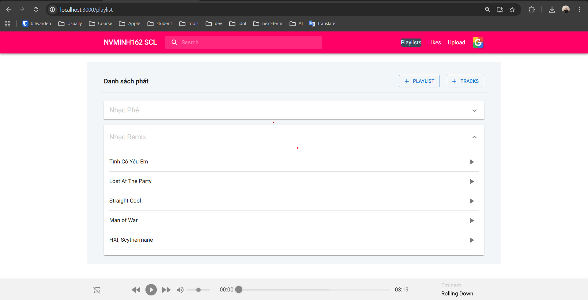

- **Create Playlists**: User-created playlists
- **Add/Remove Tracks**: Dynamic playlist management
- **Playlist Sharing**: Share playlists with other users
- **Playlist Organization**: Multiple playlists per user

#### Favorites & Likes
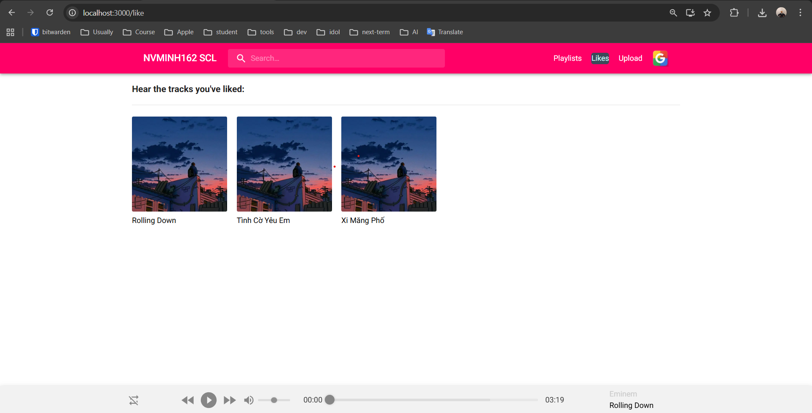

- **Like Tracks**: One-click track liking
- **Favorites Collection**: View all liked tracks
- **Like Counts**: Track popularity metrics

#### Comments System
- **Track Comments**: Comment on tracks
- **Nested Comments**: Reply to comments
- **Comment Management**: Edit and delete own comments

### 🔍 Search & Discovery

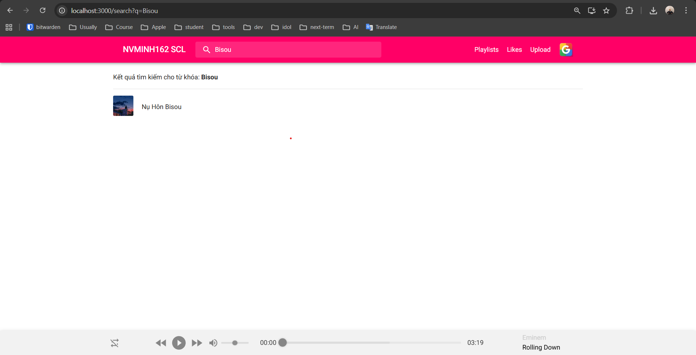

- **Full-Text Search**: Search tracks, artists, playlists
- **Search Filters**: Filter by genre, date, popularity
- **Search Suggestions**: Auto-complete functionality
- **Recent Searches**: Search history

### 👤 User Features

#### Profile Management
- **User Profiles**: Public user profiles
- **Profile Customization**: Avatar, bio, social links
- **Track History**: View user's uploaded tracks
- **Statistics**: Track counts, likes, followers

#### Authentication
- **Multiple Auth Methods**: 
  - Email/Password (Credentials)
  - GitHub OAuth
  - Google OAuth
- **Session Management**: JWT-based sessions
- **Token Refresh**: Automatic token renewal
- **Protected Routes**: Middleware-based route protection

### 📤 Upload System

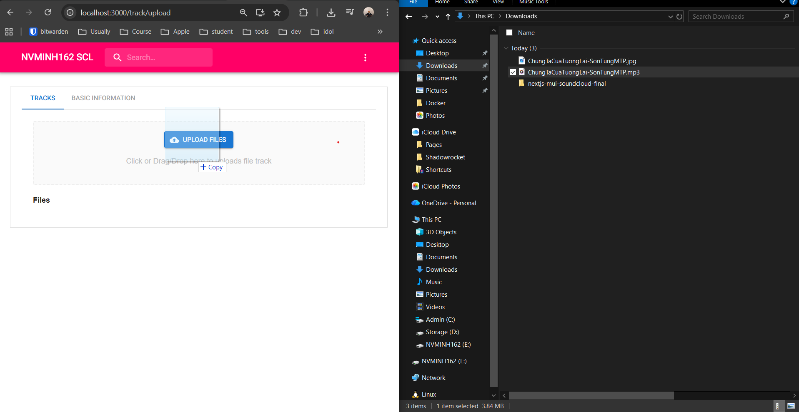
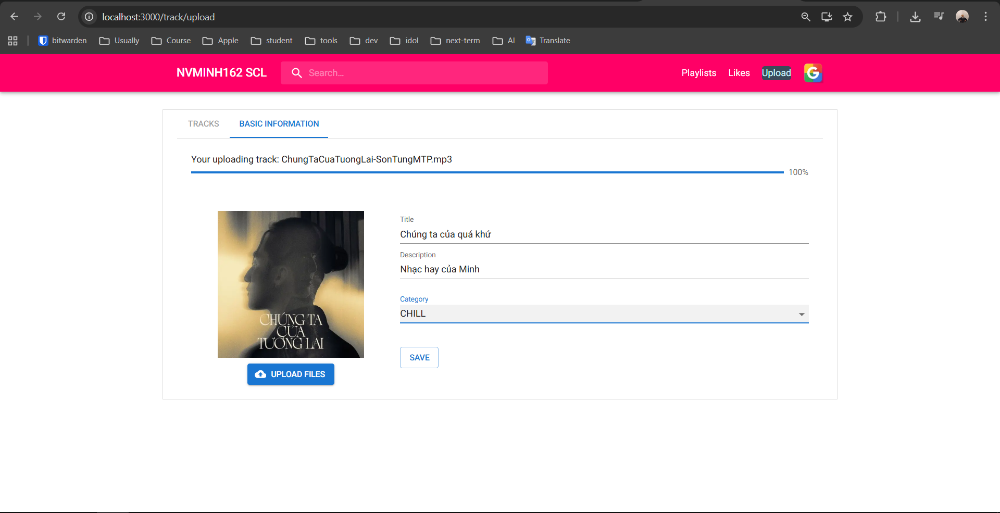

- **Multi-Step Upload**: Guided upload process
- **File Validation**: Audio format validation
- **Metadata Input**: Title, description, tags, genre
- **Image Upload**: Cover art upload
- **Progress Tracking**: Upload progress indicator
- **Draft Saving**: Save uploads as drafts

### 🎨 Admin Dashboard

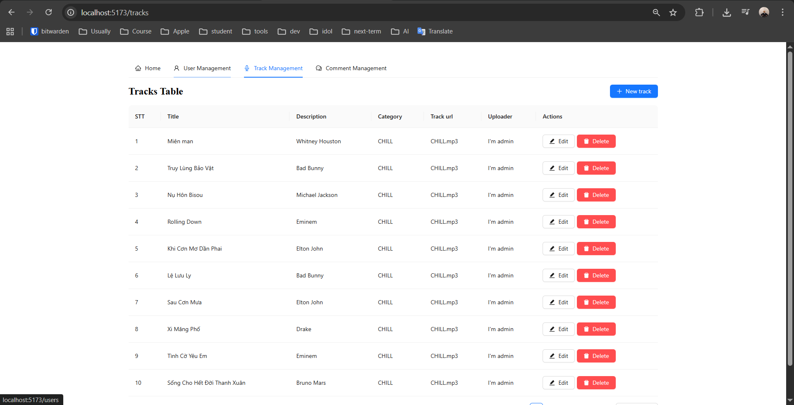

- **User Management**: CRUD operations for users
- **Track Management**: Approve, edit, delete tracks
- **Comment Moderation**: Manage comments
- **Analytics**: Basic statistics and metrics
- **Content Moderation**: Review and moderate content

### 🏠 Home Page

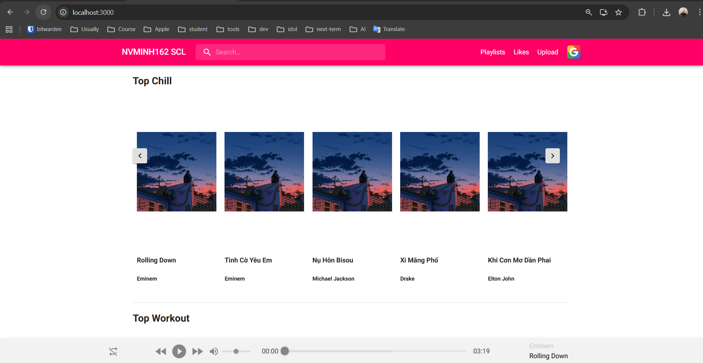

- **Featured Tracks**: Curated content
- **Trending Tracks**: Popular tracks
- **Category Carousels**: Genre-based sections
- **Recently Played**: User listening history
- **Recommendations**: Personalized suggestions

---

## 🏗️ Architecture

### Backend Architecture (NestJS - Production)

**Production-ready NestJS backend** with modular architecture:

```
soundcloud-be/
├── src/
│   ├── auth/              # Authentication (JWT, Local, OAuth)
│   ├── users/             # User management
│   ├── tracks/            # Track management
│   ├── playlists/         # Playlist system
│   ├── comments/          # Comment system
│   ├── likes/             # Like/favorite system
│   ├── files/             # File upload (Multer)
│   ├── mail/              # Email service (Nodemailer)
│   ├── databases/         # Database utilities
│   ├── health/            # Health checks
│   └── core/              # Core utilities (Filters, Interceptors, Middleware)
├── public/                # Static assets (images, tracks)
└── postman/              # API documentation
```

**Technologies:**
- NestJS 10.0.3 (Modular architecture)
- MongoDB + Mongoose 7.4.2
- Passport.js (JWT, Local strategies)
- Swagger/OpenAPI documentation
- Helmet (Security), Throttler (Rate limiting)
- Class-validator, Class-transformer
- Cache Manager, Email Service

### Frontend Architecture (Next.js)

**App Router Structure (Next.js 14):**
```
app/
├── (guest)/auth/signin/     # Guest routes
├── (user)/                  # Protected routes
│   ├── page.tsx             # Home
│   ├── playlist/            # Playlist management
│   ├── like/                # Favorites
│   ├── profile/[slug]/      # User profiles
│   └── track/upload/        # Track upload
├── api/auth/[...nextauth]/  # NextAuth.js
├── search/                  # Search (SSR)
├── track/[slug]/            # Dynamic tracks (SSG)
├── sitemap.ts               # SEO
└── robots.ts                # SEO
```

**Rendering Strategies:**
- **SSG**: `/track/[slug]`, `/profile/[slug]`
- **SSR**: `/search`, user-specific pages
- **CSR**: Interactive components

### Admin Dashboard Architecture (Vite)

**Structure:**
```
src/
├── screens/                 # Pages (users, tracks, comments)
├── components/             # Reusable components
└── main.tsx                # App entry (React Router v6)
```

---

## 🚀 Getting Started

### Prerequisites

- **Node.js**: v18.x or higher
- **MongoDB**: v6.x or higher
- **npm** or **yarn**: Package manager
- **Git**: Version control

### Installation

#### 1. Clone the Repository

```bash
git clone https://github.com/nvminh162/soundcloud-app.git
cd soundcloud-app
```

#### 2. Backend Setup

```bash
cd soundcloud-be
npm install
```

**Environment Variables** (`.env`):
```env
# Database
MONGODB_URI=mongodb://localhost:27017/soundcloud

# JWT
JWT_SECRET=your-secret-key
JWT_EXPIRE=7d
REFRESH_TOKEN_SECRET=your-refresh-secret
REFRESH_TOKEN_EXPIRE=30d

# Server
PORT=8000
NODE_ENV=development

# Email (Optional)
MAIL_HOST=smtp.gmail.com
MAIL_PORT=587
MAIL_USER=your-email@gmail.com
MAIL_PASS=your-app-password

# OAuth (for social login)
GITHUB_CLIENT_ID=your-github-client-id
GITHUB_CLIENT_SECRET=your-github-client-secret
GOOGLE_CLIENT_ID=your-google-client-id
GOOGLE_CLIENT_SECRET=your-google-client-secret
```

**Run Backend:**
```bash
# Development
npm run start:dev

# Production
npm run build
npm run start:prod
```

#### 3. Next.js Client Setup

```bash
cd soundcloud-fe/soundcloud-nextjs-client
npm install
```

**Environment Variables** (`.env.local`):
```env
# Backend API
NEXT_PUBLIC_BACKEND_URL=http://localhost:8000

# NextAuth
NEXTAUTH_URL=http://localhost:3000
NEXTAUTH_SECRET=your-nextauth-secret

# Token Configuration
TOKEN_EXPIRE_NUMBER=7
TOKEN_EXPIRE_UNIT=days

# OAuth Providers
GITHUB_ID=your-github-client-id
GITHUB_SECRET=your-github-client-secret
GOOGLE_ID=your-google-client-id
GOOGLE_SECRET=your-google-client-secret
```

**Run Next.js Client:**
```bash
# Development
npm run dev

# Production Build
npm run build
npm start
```

#### 4. Admin Dashboard Setup

```bash
cd soundcloud-fe/soundcloud-vite-admin
npm install
```

**Environment Variables** (`.env`):
```env
VITE_BACKEND_URL=http://localhost:8000
```

**Run Admin Dashboard:**
```bash
# Development
npm run dev

# Production Build
npm run build
npm run preview
```

### Development Workflow

1. **Start MongoDB**: Ensure MongoDB is running
2. **Start Backend**: `cd soundcloud-be && npm run start:dev`
3. **Start Next.js Client**: `cd soundcloud-fe/soundcloud-nextjs-client && npm run dev`
4. **Start Admin Dashboard** (optional): `cd soundcloud-fe/soundcloud-vite-admin && npm run dev`

### Access Points

- **Next.js Client**: http://localhost:3000
- **Backend API**: http://localhost:8000
- **Admin Dashboard**: http://localhost:5173 (Vite default)
- **API Documentation**: http://localhost:8000/api (Swagger)

---

## 📚 Learning Objectives & Concepts Demonstrated

### Backend (Production NestJS)
- RESTful API design, Modular architecture
- Authentication (JWT, OAuth 2.0, Passport.js)
- MongoDB schema design, Mongoose ODM
- File upload (Multer), Email service
- Security (Helmet, Throttler, Validation)
- API documentation (Swagger), Health checks

### Frontend (Next.js)
- Next.js 14 App Router, Server/Client Components
- Rendering strategies (CSR, SSG, SSR, ISR)
- Dynamic routes, API routes, Middleware
- SEO (Meta tags, Sitemap, Robots.txt)
- NextAuth.js (OAuth, JWT sessions)
- TypeScript, Image optimization

### Admin Dashboard (Vite)
- Vite build tooling, React Router v6
- Ant Design UI, Component architecture

---

## 🔧 Configuration

### Backend (Production)
- MongoDB connection: `MONGODB_URI` in `.env`
- JWT: `JWT_SECRET`, `JWT_EXPIRE`, `REFRESH_TOKEN_SECRET`
- Rate limiting: Configure in `app.module.ts`
- OAuth: GitHub, Google client IDs/secrets

### Frontend
- Next.js: `next.config.js` (image domains, optimizations)
- API: `NEXT_PUBLIC_BACKEND_URL` in `.env.local`
- NextAuth: `NEXTAUTH_URL`, `NEXTAUTH_SECRET`
- Theme: `src/components/theme-registry/theme.ts`

---

## 📊 Performance Metrics

**Next.js Bundle Sizes:**
- First Load JS: 305 kB (shared)
- Middleware: 63 kB
- `/profile/[slug]`: 270 kB
- `/track/[slug]`: 191 kB
- `/playlist`: 190 kB

**Optimizations:** Code splitting, Tree shaking, Image optimization, Lazy loading, Caching

---

## 🧪 Testing

**Backend:**
```bash
cd soundcloud-be
npm run test          # Unit tests
npm run test:watch    # Watch mode
npm run test:cov      # Coverage
npm run test:e2e      # E2E tests
```

**Frontend:**
```bash
cd soundcloud-fe/soundcloud-nextjs-client
npm run lint          # Linting
```

---

## 🐳 Docker Support

**Docker configuration available:**
- `soundcloud-fe/soundcloud-nextjs-client/Dockerfile`
- `soundcloud-fe/soundcloud-nextjs-client/build-docker/docker-compose.yml`

```bash
cd soundcloud-fe/soundcloud-nextjs-client/build-docker
docker-compose up
```

---

## 📖 API Documentation

**Swagger:** `http://localhost:8000/api`

**Postman Collection:** `soundcloud-be/postman/soundcloud-app-backend-api.postman_collection.json`

**Main Endpoints:**
- **Auth**: `/api/v1/auth/register`, `/login`, `/refresh`, `/social-media`
- **Tracks**: `/api/v1/tracks` (GET, POST, PUT, DELETE)
- **Users**: `/api/v1/users` (GET, PUT, DELETE)
- **Playlists**: `/api/v1/playlists` (GET, POST, PUT, DELETE)
- **Comments**: `/api/v1/comments` (GET, POST, PUT, DELETE)
- **Likes**: `/api/v1/likes` (GET, POST, DELETE)

---

## 🎓 Educational Resources

This project was developed as part of a comprehensive learning journey. The following resources were instrumental:

### Course
- **Udemy Course**: [React Next.js MUI TypeScript Course](https://www.udemy.com/course/hoidanit-react-nextjs-mui-typescript)
  - Comprehensive full-stack development course
  - Covers React, Next.js, Material-UI, TypeScript
  - Backend development with NestJS
  - Authentication and authorization
  - SEO optimization
  - Performance optimization

### Key Learning Topics

1. **Full-Stack Development**: End-to-end application development
2. **Modern React**: Hooks, Context, Server Components
3. **Next.js 14**: App Router, Server Actions, ISR
4. **NestJS**: Modular architecture, dependency injection
5. **TypeScript**: Advanced types, generics, utility types
6. **Authentication**: OAuth 2.0, JWT, session management
7. **Database Design**: MongoDB, Mongoose, schema design
8. **API Design**: RESTful APIs, error handling, validation
9. **SEO**: Meta tags, sitemaps, structured data
10. **Performance**: Code splitting, lazy loading, optimization

---

## 🤝 Contributing

This is a learning project, but contributions and suggestions are welcome! If you'd like to contribute:

1. Fork the repository
2. Create a feature branch (`git checkout -b feature/amazing-feature`)
3. Commit your changes (`git commit -m 'Add some amazing feature'`)
4. Push to the branch (`git push origin feature/amazing-feature`)
5. Open a Pull Request

---

## 📝 License

This project is licensed for educational purposes. All rights reserved by the author.

**LICENSED By @nvminh162**

---

## 👨‍💻 Author

### Contact Information

- **GitHub**: [@nvminh162](https://github.com/nvminh162)
- **Facebook**: [facebook.com/nvminh162](https://facebook.com/nvminh162)
- **Telegram**: [@nvminh162](https://t.me/nvminh162)
- **Website**: [nvminh162.com](https://nvminh162.com/)

### About the Project

This project was developed as a comprehensive learning exercise to master modern full-stack web development. It demonstrates proficiency in:

- **Backend Development**: NestJS, MongoDB, RESTful APIs
- **Frontend Development**: Next.js 14, React 18, TypeScript
- **Authentication**: OAuth 2.0, JWT, NextAuth.js
- **SEO Optimization**: Meta tags, sitemaps, structured data
- **Performance Optimization**: Code splitting, lazy loading, caching
- **Modern Tooling**: Vite, TypeScript, ESLint

### Acknowledgments

Special thanks to:
- **Udemy Instructor**: For the comprehensive course content
- **Open Source Community**: For the amazing tools and libraries
- **NestJS Team**: For the excellent framework
- **Next.js Team**: For the powerful React framework
- **Material-UI Team**: For the beautiful component library
- **Ant Design Team**: For the enterprise UI components

---

## 🎯 Project Showcase

### Screenshots

The project includes comprehensive screenshots demonstrating all major features:

- **Authentication**: GitHub and Google OAuth flows
- **Rendering Strategies**: CSR, SSG, SSR demonstration
- **SEO Features**: Optimization and best practices
- **Home Page**: Main landing page with featured content
- **Search**: Full-text search functionality
- **Playlists**: Playlist management interface
- **Favorites**: Liked tracks collection
- **Upload**: Multi-step track upload process
- **Admin Dashboard**: Content management interface

All showcase images are available in the `soundcloud-showcase/` directory.

---

## 📈 Future Enhancements

Potential improvements and features for future development:

1. **Real-time Features**: WebSocket integration for live updates
2. **Advanced Search**: Elasticsearch integration
3. **Recommendation Engine**: ML-based track recommendations
4. **Social Features**: Followers, following, activity feed
5. **Analytics**: User behavior tracking, insights
6. **Mobile App**: React Native mobile application
7. **PWA**: Progressive Web App features
8. **Internationalization**: Multi-language support
9. **Payment Integration**: Premium subscriptions
10. **Advanced Admin**: More comprehensive admin features

---

## 🐛 Known Issues

- Some routes may have performance optimization opportunities
- Image optimization can be further enhanced
- Additional error handling in edge cases
- More comprehensive test coverage needed

---

## 📞 Support

For questions, issues, or suggestions:

- Open an issue on GitHub
- Contact via Telegram: [@nvminh162](https://t.me/nvminh162)
- Reach out on Facebook: [facebook.com/nvminh162](https://facebook.com/nvminh162)

---

**Built with ❤️ by @nvminh162**

*This project is part of a comprehensive learning journey in modern full-stack web development.*

